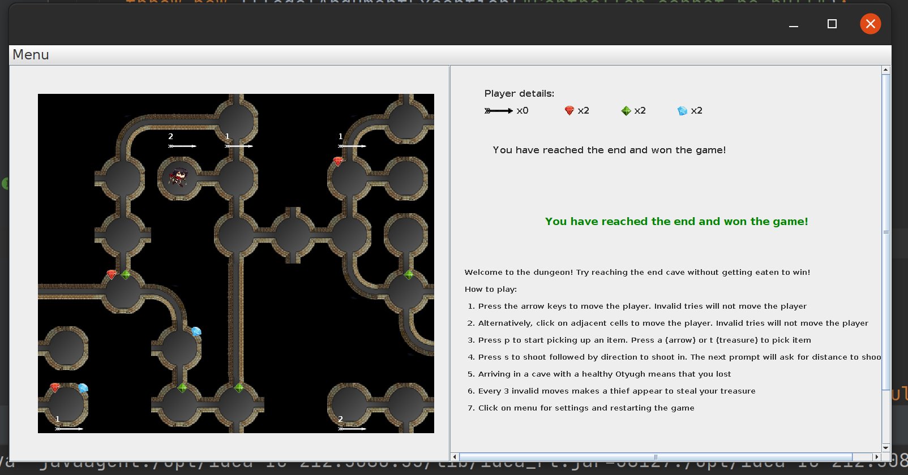
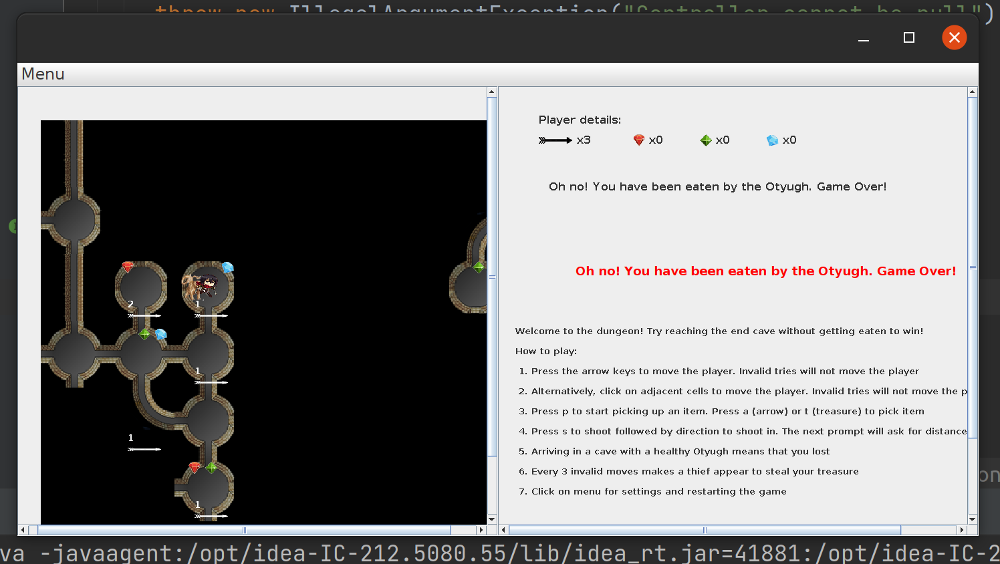
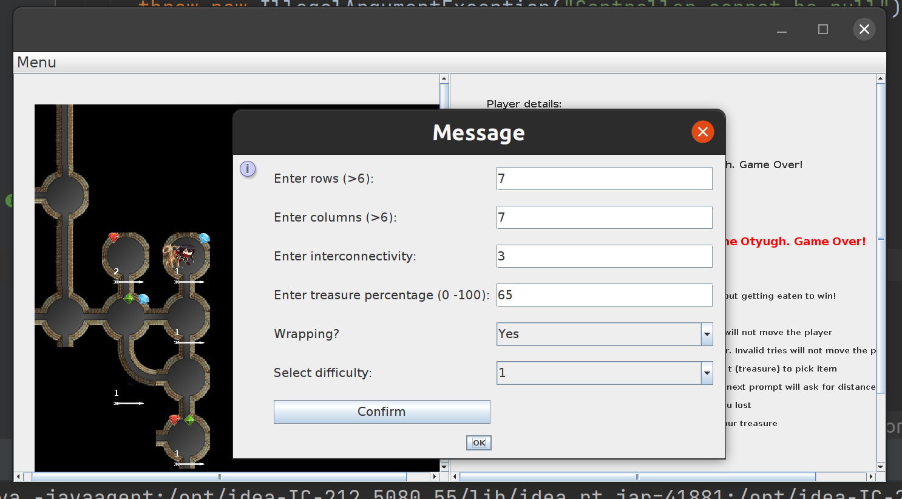
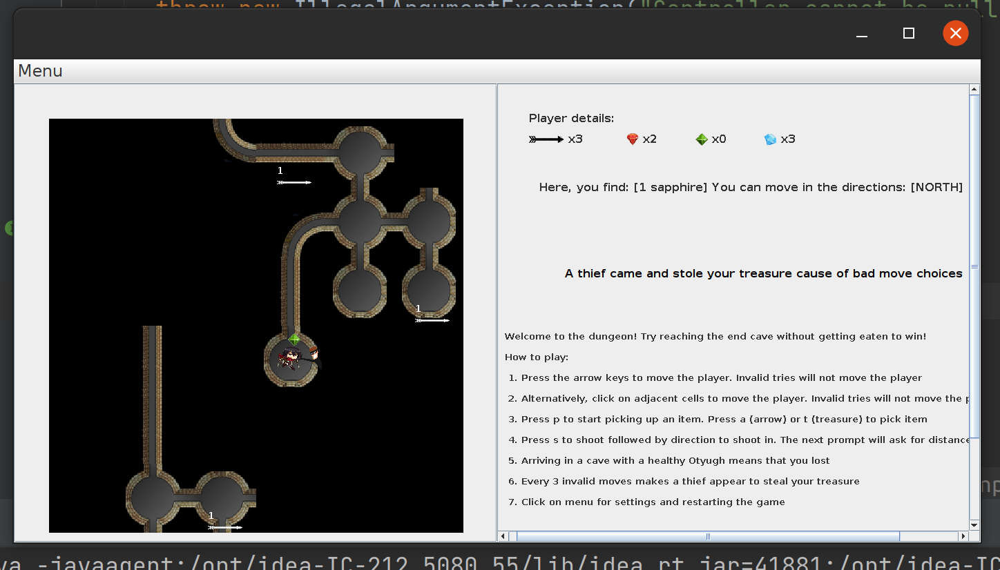

# Project 5 - Graphical Adventure Game

### Overview
A dungeon is a network of tunnels and caves that are interconnected so that a player can explore the entire world by traveling from cave to cave through the tunnels that connect them. Each location in the dungeon represents a cell where a player can explore and can be connected to at most four (4) other locations: north, east, south, west. Each cell on the grid can either be a tunnel (2 entrances) or a cave (1, 3, 4 entrances). Caves carry treasures which the player can collect while exploring the dungeon.
There are Otyughs present in the dungeon as well. A player entering a cave with an Otyugh that has not been slayed will be killed and eaten. To give the player the ability to slay the Otyugh, they will automatically be equipped with a bow that uses crooked arrows. It takes 2 hits to kill an Otyugh. Arrows are present throughout the dungeon for the player to pick up.
The game can be played in either a text based adventure game or in a GUI.
The GUI is used interactively where a user can move, pick, shoot or restart a game using mouse clicks and keyboard presses and the outcome being reflected on the view. Every 3 invalid moves made by a player makes a thief show up who will steal one of the treasures collected by the player.

### List of features
- When the GUI is launched, the game starts with a default dungeon which can be played. To change or view 
the settings, user can click on Menu in the toolbar. The same game can be restarted using "Same game", or a new game can 
be created using "New game" from the menu and updating the settings
- Each dungeon created would have treasure, arrows and Otyughs present in them. There is also a thief who appears when
multiple wrong moves are made and would steal one of the player's collected treasure.
- A player starts at the start cave and is to move around the dungeon till they reach the end without getting eaten by an Otyugh.
- An Otyugh can be detected by levels of smell depending on how close Otyugh(s) are.
- The user can perform the following actions: move the player, pick up items, shoot arrows, restart game
- An Otyugh is killed by the player when the player hits that Otyugh with an arrow twice.
- The player wins the game if they reach the end cave without getting eaten. They lose if they encounter a healthy or sometimes injured Otyugh.

### How to run
GUI:
java -jar Project05.jar

Text based game:
java -jar Project05Sonal.jar rows columns interconnectivity percentage difficulty y/n

### How to use the program
GUI:
Once the game is launched, a default game is started. 
A user can perform the following actions:
1. Move: - The player is moved around the dungeon using arrow keys or by clicking on adjacent cells.  
         - If the user tries to move the player where there is no exit, it is counted as an invalid move. 3 invalid moves will lead to a thief stealing treasure 
         - Clicking on non-adjacent cells or outside the grid is an illegal move. 
2. Pick: - The key "p" followed by "a" is used to pick up a single arrow present in the current location. If there is no arrow, the status will display that there are no arrows to pick  
         - The key "p" followed by "t" is used to pick up all treasure present in the current location. If there is no treasure, the status will display that there is no treasure to pick
3. Shoot: - The key "s" followed by an arrow key will pop a dialog to enter distance (1-5) to shoot. The status will display the outcome of the shot
4. View settings: - Click on menu and then settings to view the current specifications of the game
5. Restart: - Click on menu and then restart. Same game will launch the same game again. New game would allow the user to change the specifications  
            - On clicking on New game, a dialog box would open to update settings. The game would only be reset when user clicks on "Confirm" and then "Ok". Clicking on "Ok" directly will not start a new game.  
            - Specifications: Rows and columns (greater than 6), interconnectivity, percentage (0-100), wrapping (drop-down), difficulty (drop-down)  
            - Invalid entries will prompt user to enter again
6. Quit: - Click on menu and then quit

Text based:
The jar file is run to start the dungeon  
Arguments: 
1. number of rows (greater than 6)
2. number of columns (greater than 6)
3. interconnectivity
4. percentage of treasure (between 0 and 100)
5. difficulty (1, 2 or 3)
6. "Yes" or "Y" for wrapping, "No" or "N" for non-wrapping

Once the dungeon is created, the program will prompt user for next command.

### Description of examples
##### Sample run 01
The sample run shows the player winning the game. 
The items present in locations can be seen on the respective cells.
Once player picks up any item, it is removed from the location.
Player details represents what the player has collected in the game. 
There is a status panel which indicates what action player performed, and what is the outcome of the action.

##### Sample run 02
The sample run shows the player losing after getting eaten by an Otyugh.

##### Sample run 03
This run shows the specifications which can be updated by using the menu bar.

#### Sample run 04
This run shows the thief stealing the player's treasure.
In this run, the player made 3 invalid moves after which a thief appears in the current location of
the player and took 1 treasure from the player.

### Design changes
1. Separated the controllers for text based and GUI version.
2. Added thief to the game.
3. Included panels for status and instructions in addition to the player and location descriptions.

### Assumptions
1. The game starts with a default game first. The settings can then be updated from the menu
2. Player picks up all the treasure from current location
3. Thief steals one treasure at once. If player has no treasure, the count of treasure remains 0.
4. Player can shoot only between 1 and 5 caves

### Limitations
1. An Otyugh which has been shot by the player would not be seen on the screen. Once the player shoots
an Otyugh twice, the status displays whether the Otyugh was killed.
2. When the user enters new settings, they have to first click on "Confirm" to update the game. Then click on OK to close the settings window.
Clicking on OK directly will not start a new game.
3. Status of the arrow being shot is displayed in the status panel and is not seen on the grid.

### Citations
- https://www.javatpoint.com/kruskal-algorithm-java
- https://www.geeksforgeeks.org/print-all-neigbour-nodes-within-distance-k/
- https://www.section.io/engineering-education/graph-traversals-java/
- https://northeastern.instructure.com/courses/90366/pages/8-dot-6-command-design-pattern?module_item_id=6535611
- https://northeastern.instructure.com/courses/90366/pages/11-dot-8-full-mvc-example?module_item_id=6594078
- https://stackoverflow.com/questions/6555040/multiple-input-in-joptionpane-showinputdialog/6555051
- https://stackoverflow.com/questions/299495/how-to-add-an-image-to-a-jpanel
- https://docs.oracle.com/javase/tutorial/uiswing/components/menu.html
- https://docs.oracle.com/javase/tutorial/uiswing/components/combobox.html
- https://docs.oracle.com/javase/tutorial/uiswing/components/panel.html
